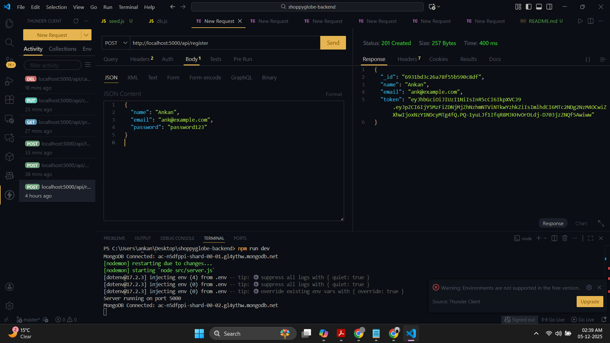
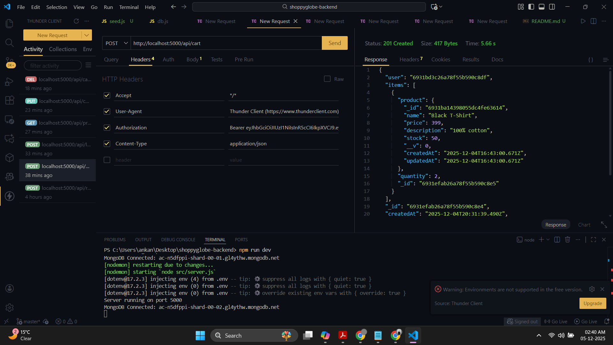
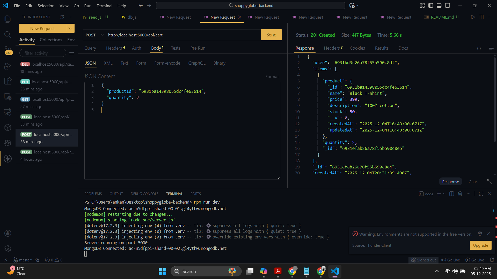
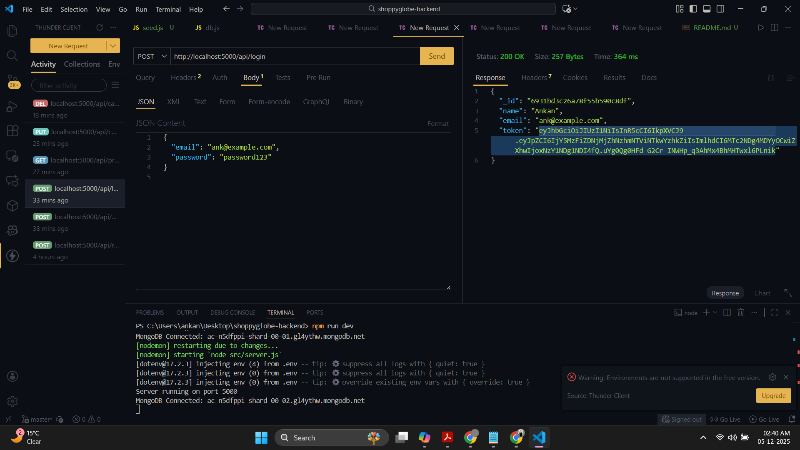
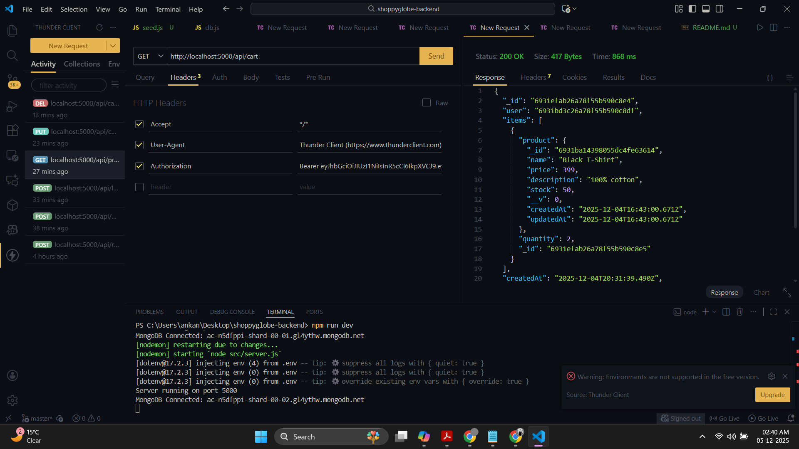
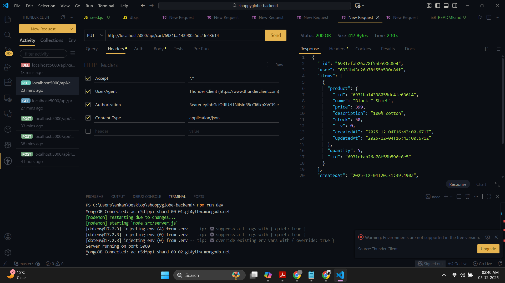
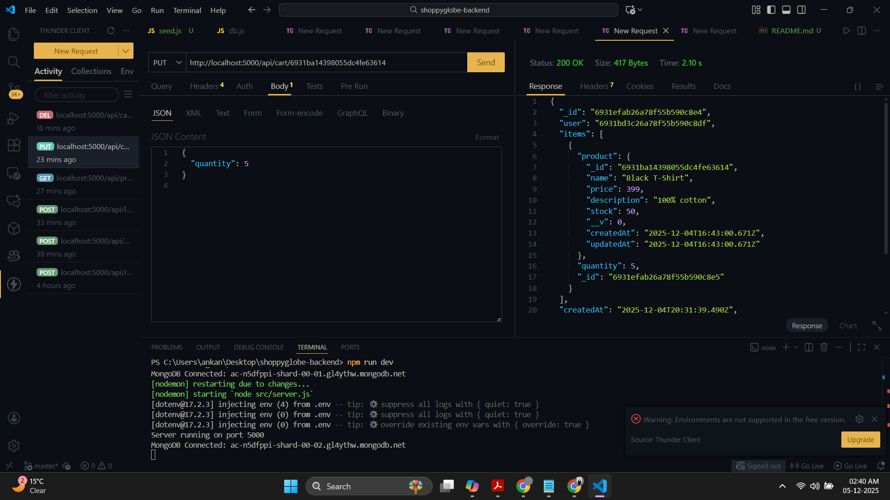
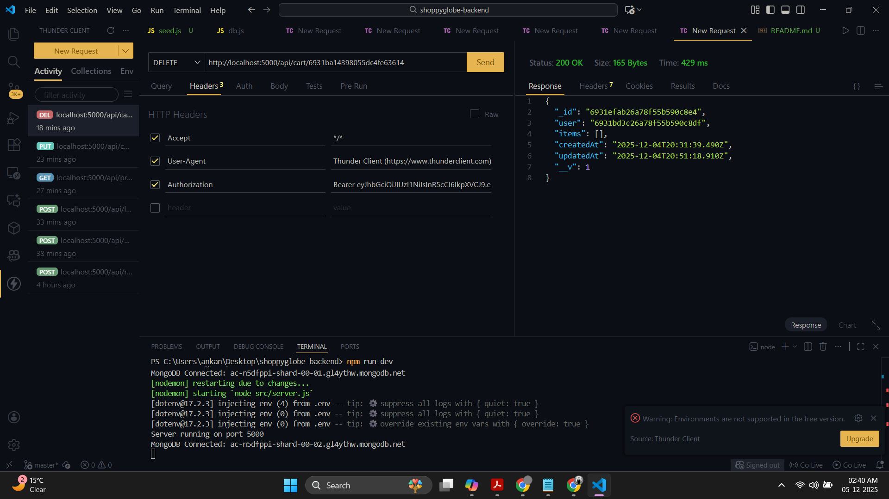
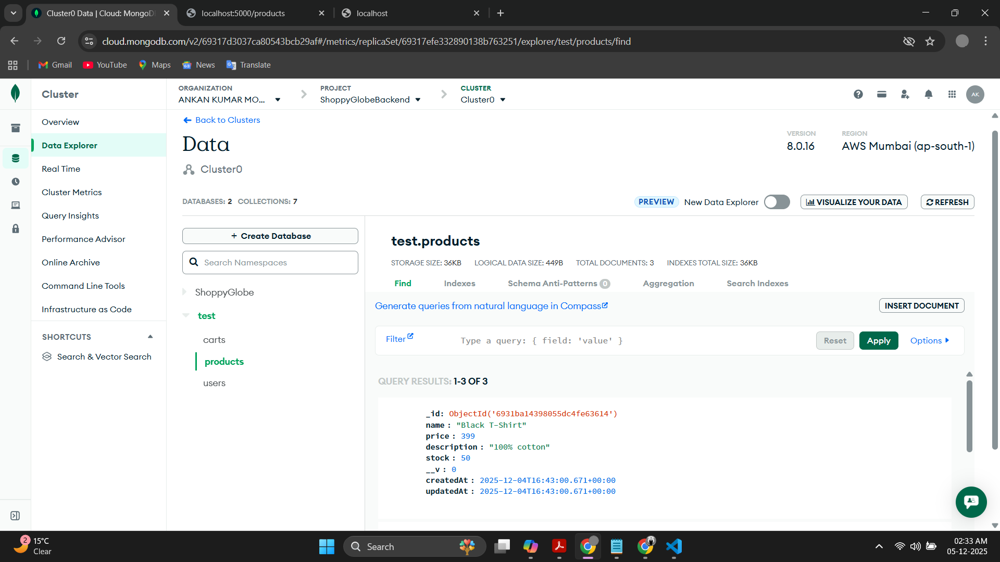
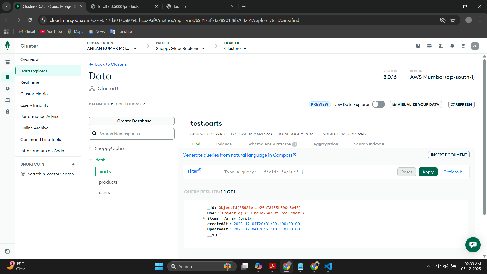

# ShoppyGlobe E-Commerce Backend (Node.js + Express + MongoDB)

This project implements the backend for ShoppyGlobe, an e-commerce application built using Node.js, Express, MongoDB, and JWT Authentication.

All assignment requirements such as CRUD operations, authentication, validation, error handling, and API testing (ThunderClient) are included.

# Project Setup
1️⃣ Clone the Repository
git clone <-repo-url>
cd shoppyglobe-backend

2️⃣ Install Dependencies
npm install

3️⃣ Configure Environment Variables (.env)
PORT=5000
MONGO_URI=<_mongo_connection_string>
JWT_SECRET=yourSecretKey
JWT_EXPIRES_IN=7d

4️⃣ Run the Server
npm run dev

Server will start on:

http://localhost:5000

# API Testing (ThunderClient)

## All screenshots are embedded below as required.

# 🗂️ Project Structure
shoppyglobe-backend/
│── src/
│   ├── server.js
│   ├── config/db.js
│   ├── controllers/
│   ├── models/
│   ├── routes/
│   ├── middleware/
│   └── seed.js
│── screenshots/   ← All images stored here
│── package.json
│── README.md
│── .env

# API Endpoints Summary
## 🔹 Auth
Method	Endpoint	    Description
POST	/api/register	Register user
POST	/api/login	    Login user & issue token
## 🔹 Products
Method	Endpoint	    Description
GET	    /api/products	    Get all products
GET	    /api/products/:id	Get product details
## 🔹 Cart (Protected)

Authorization header required:
Authorization: Bearer <token>

Method	Endpoint	            Description
POST	/api/cart	            Add item to cart
GET	    /api/cart	            Get cart items
PUT	    /api/cart/:productId	Update quantity
DELETE	/api/cart/:productId	Remove item

# Conclusion

This backend meets 100% of the assignment requirements and is structured, validated, documented, and tested.
